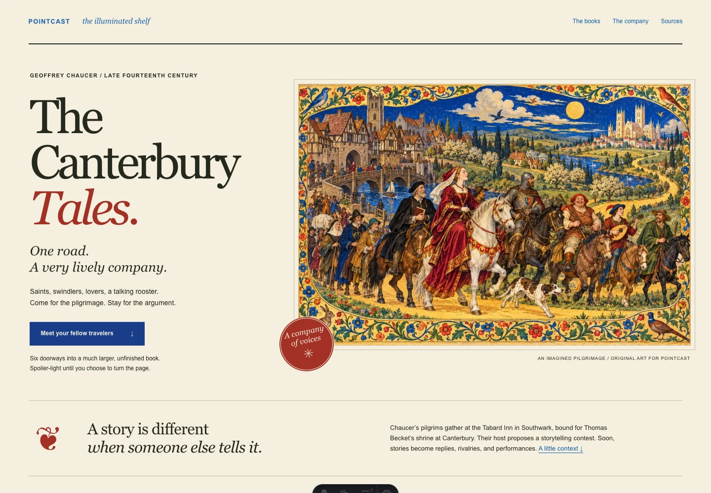
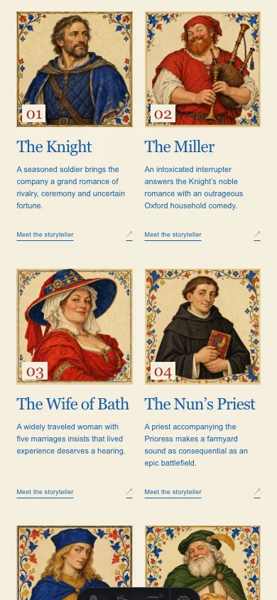
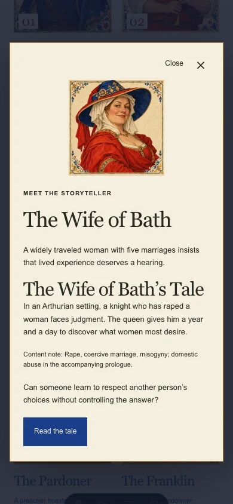
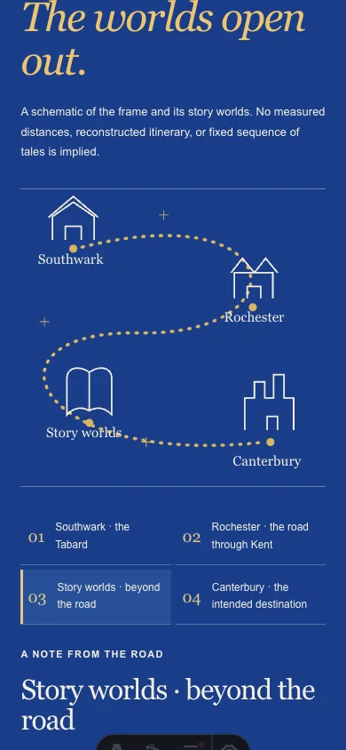
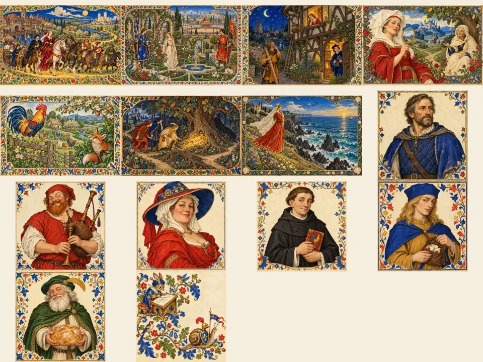

# Canterbury · A company of voices

3 October 2026. Authorized illustrated Canterbury experience for PointCast.

## Scope

- `/canterbury/` and `/canterbury.json` are isolated public-reading routes, with a return to `/books/`. The books owner controls the hub link; this PR does not edit it.
- Fourteen separately generated original artworks: hero, six interpretive portraits, six tale scenes, manuscript marginalia. Forty responsive WebP renditions, 7.05 MB in aggregate; the largest image is 603 KB. Portraits and below-fold scenes load lazily. Exact generation prompts, dimensions and checksums: `public/images/canterbury/provenance.json`.
- Pilgrim dialogs, reader-selected two-tale routes, a schematic journey, paired storytelling themes, four individually numbered Middle English selections with original glosses, native spoiler disclosures, and marginal reading questions.
- Original summaries rather than reproduced modern translations. Harvard primary texts and scholarship, Canterbury Cathedral, a public-domain Skeat edition, and British Library manuscript context are sourced in the page and JSON. No fabricated Chaucer quotations.
- Visible content notes before plot reveals. Narrator/author/character voices, unfinished framing, disputed fragment order and imaginative geography are distinguished.

## Verification

- Thirteen focused Node/jsdom behavior tests pass, including native-dialog fallback, repeated initialization, interrupted close events, both directions of Tab wrapping, Escape focus return and reduced-motion reading focus.
- Actual installed Chrome with an isolated profile: 1440 × 1000 desktop, 390 × 844 phone, 320 × 740 narrow phone and 390 px JavaScript-disabled mode. Keyboard reading-route selection, thematic connections, journey switches, language modes, spoiler reveal/close, dialog repetition and focus tested.
- Zero runtime page errors, zero failed responses, no horizontal overflow. Axe 4.11.0 reports zero WCAG A/AA violations on the page and open dialog at all three enhanced viewports. No-JS reading paths, all journey notes, both passage modes and native spoilers remain usable.
- Full `npm run build:bare` passed once across 2808 pages. Final source rebuild and independent exact-head review are recorded in the PR handoff. Publishing and agent audits run; final clean-head publishing audit follows commit.
- Repository-wide tests were also run; unrelated baseline failures are documented in the final handoff rather than hidden as Canterbury failures.

## Evidence

Browser results: `docs/research/canterbury-browser-20261003.json`.

## Hold and archival limitation

Merge to main requires independent X review and Mike’s approval; production publication also requires Mike’s explicit approval and the parent’s serialized lane. Neither merge nor deploy was performed.

Generated outputs returned local files without native Library IDs. The current Library prepared-upload helper could not discover preparation, so no archival save was completed and no identity was invented. All original PNGs remain in the authorized task workspace’s `canterbury-art-originals/`, and optimized consumer-verified bytes are committed here. This archival limitation does not prevent the website preview or review.
