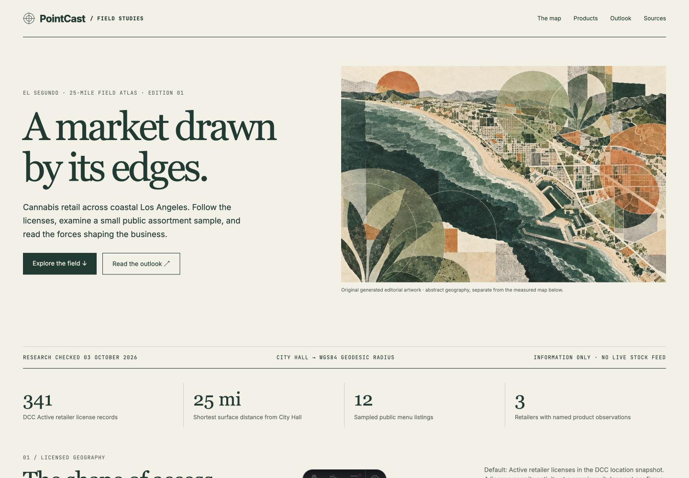
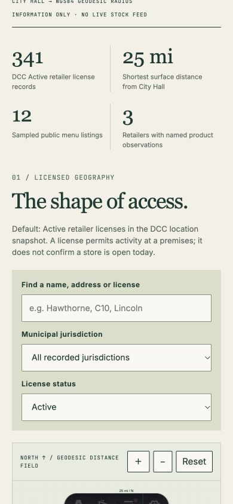

# El Segundo dispensary research atlas — 2026-10-03

## Deliverable and publication state

New independent routes: `/dispensary-atlas` and `/dispensary-atlas.json`. This is an informational first edition with a dated, downloadable public-evidence snapshot. No checkout, order, cart, reservation, delivery arrangement, account flow or analytics is included. Shared home, Latest Projects, UES index, authentication and wallet surfaces are untouched. The companion UES business index belongs to the coffee study worker and remains a pending preview until publication.

Draft PR only. X review and MH approval remain required by the repository's merge policy; publication must use the parent's serialized lane and `docs/OPERATIONS.md`. No merge or deploy was performed.

## Declared geography and registry coverage

The center is the Census-interpolated address point for El Segundo City Hall, 350 Main Street, El Segundo, California: **33.91992025096, -118.415864992665**. This analytical center is not a surveyed rooftop or building centroid. Inclusion uses the shortest WGS84 ellipsoidal geodesic distance at or below **25 statute miles**. The north-up map projects geodesic distance and bearing; its radial scale is measured, with no street basemap. The original cover art is separately labeled as abstract geography.

Eleven pages of DCC's public retailer-location endpoint returned 545 unique bounding-box records. Independent numerical WGS84 checks confirmed 531 inside the radius. The atlas retains **485 Type 10 retailer license records**, including **341 Active**, 104 Expired, 30 Surrendered, 6 Revoked, 3 Canceled and 1 Suspended. The other 46 records are microbusinesses, excluded pending verification of retail activity and format. Nonstorefront delivery coverage has no usable public coordinates and cannot be assigned to this radius. These omissions do not imply zero delivery activity.

The default filters show Active records. Optional history shows all 485. Licenses are not unique operating shops: co-located, successor and designation records can overlap. Active means licensed activity at a listed premises, not independent proof that a shop is open today. Registry coordinates and municipal fields are retained; postal/marketing names are separate. Two anomalous human-name jurisdiction values are withheld as unresolved. Owner names, private contacts, unpublished premises and raw responses with personal fields are excluded.

DCC's source refresh string is `2026-10-03T06:31:37.3266667` with an unspecified source timezone. Retrieval timestamps are separately recorded. All public rows link to the registry and source provenance. Official municipal sources cover El Segundo, Hawthorne, West Hollywood and Santa Monica; current municipal code takes precedence over stale policy summaries. City Hall coordinates match the coffee atlas's declared center.

## Assortment and economic evidence

Six operators received detailed public-source checks. Search covers **14 actual named observations**: six HAVEN Hawthorne menu listings, six ERBA Venice menu listings and two Pottery editorial product mentions. Each card records evidence type, source, checked date, reader crawl freshness, observed price/size where available and unknown price-tax basis. Availability is unverified for every row. This is not a complete inventory or live stock feed. ERBA prices were corrected after an independent check returned newer promotional values than the first cached result.

Sweet Flower's age gate was left unaccepted. Artist Tree and Original Green Cross menu widgets could not be read in the authorized public text surface. Access gaps are disclosed. No gates, robots, login requirements or technical access limits were bypassed. Product filters operate locally on the observed sample, by query, brand, category and retailer; official menu links remain research references.

The downloadable snapshot contains **37 sources**, 14 official CDTFA quarters (2023 Q1–2026 Q2), six operator profiles, four municipal cases and the displayed local/California/national interpretations. The visible California chart shows the latest six quarters; all 14 are exported. Cannabis excise-tax sales, broader taxable sales, tax receipts, nominal units, periods and revisability remain separate. Pre-2023 zeros from the reporting discontinuity are not treated as zero market sales. CalendarYear plus Quarter resolves the endpoint's repeated YearQuarter field.

Reported 2025 cannabis sales are $3,933,440,720 (−6.496% from 2024). 2026 H1 is $1,977,161,767 (−0.286% from 2025 H1). Store-level sales and local retail demand are unavailable and are not inferred from menus or license counts. LAO fiscal estimates/forecasts and Los Angeles's conditional business-tax projection are labeled distinctly from actual receipts. The $28.6–29.6 billion national 2025 figure is an industry estimate with scope/date limitations, not an official census or a denominator for a California market-share calculation.

Selected California, New York and Florida programme examples, medicinal/adult-use distinctions, narrow current federal rescheduling context and a separate hemp framework use dated official sources. This is not a 50-state legal census or store-level DEA-registration verification. It provides no tax/legal advice, health claims or financial projections for an individual store.

## Interface and validation

- Basemap-free measured point map, municipal/status/license/address search, keyboard record picker and paginated table fallback.
- Product sample filters, empty states, source links, coverage table and filter-sharing URL textbox. Search text is encoded; no clipboard permission is requested.
- Static no-JavaScript license/product/source content, chart tables, a JSON download and reduced-motion styles.
- **24/24 tests passed:** 16 geodesic/filter/URL tests and 8 public-dataset/provenance/privacy/economic checks. GeographicLib reference fixtures and an independent ellipsoid integration verify the radius independently of the implementation.
- Independent evidence review cross-checked every mapped retailer, every quarter, revised products, municipalities and all source references. Independent implementation review found no remaining material issues after wrapping mobile table headers/product metadata and preserving table-row layout and record names in print.
- Chrome/CUA browser checks passed for 341 Active/default pins, 485 historical records, exact-license lookup, off-page record selection, combined product filters, shared URLs and literal-markup safety.
- **1440×1000** and **390×844** had document widths equal to viewport widths. At 390px both expanded economics tables fit (314px and 350px respectively). The horizontal license list is intentionally contained in its labeled scroll region. The temporary shared viewport override was reset.
- Captured desktop/mobile development previews below. No exact-viewport claim is made for the independent reviewer's separate 406px browser pass.
- The focused Astro production build compiled the actual two route entrypoints with the repository's existing integrations in 21.44 seconds initially and 10.03 seconds after rebasing onto the fetched main. Its generated HTML contains one main region, all 485 fallback rows and 14 product cards. Inline and downloadable JSON match the source snapshot. The client bundle is 8,220 bytes before compression.
- `audit:agents` passed. `audit:publishing` had no policy errors and is rechecked with the clean committed branch. The full-site `build:bare` was interrupted during static entrypoint compilation, with no terminal compiler error, under heavy shared Mac load. It is **uncompleted**, not a passing full-site check or an established build failure. Other unchanged worktrees reported 16 minutes in that phase and 22–40 minutes for full builds. The atlas-route production build passed separately; a complete site build remains part of the publication gate.

The focused build used a temporary, uncommitted config that kept the repository's integrations/Vite settings, set an empty source directory, injected the exact `/dispensary-atlas` and `/dispensary-atlas.json` entrypoints, and wrote to a temporary output directory. It is not a full-site build and is not part of the deploy configuration. Heavy local dependencies/build outputs and preview processes are removed after review packaging.

## Artwork provenance

Built-in ImageGen generated one original 1536×1024 editorial plate. The original was visually inspected and encoded as a 524KB WebP. It contains no people, consumption scene, products, packaging, logos, endorsement or health claims. No additional generations or visual edits were requested.

Exact generation brief:

Use case: stylized-concept
Asset type: one original wide 1536×1024 in-page editorial plate for a sophisticated adult research publication about the geography and economics of legal cannabis retail around coastal Los Angeles.
Primary request: an abstract aerial coastal urban grid meeting the Pacific shoreline, overlaid with translucent circular research fields and restrained mineral botanical geometry, evoking a tactile research atlas.
Style/medium: beautifully composed cut-paper collage and risograph print; fine paper grain, gently imperfect ink registration, sculptural graphic forms, crisp deliberate edges.
Composition/framing: landscape 3:2, 1536×1024; an elegant coastal curve, angular streets and blocks, overlapping circular fields; balanced quiet space and layered depth, suitable for an editorial essay.
Color palette: pale warm ivory, dark forest ink, sage green, oxidized orange, sparing mineral gray.
Lighting/mood: calm, analytical, mature, artful.
Constraints: abstract editorial geography only, never a factual map; no text, letters, labels, legends, logos or watermark.
Avoid: people, minors, consumption imagery, glamorization, cannabis products, packaging, brands, health claims, bright neon, decorative clip art.
Generate exactly one image.
