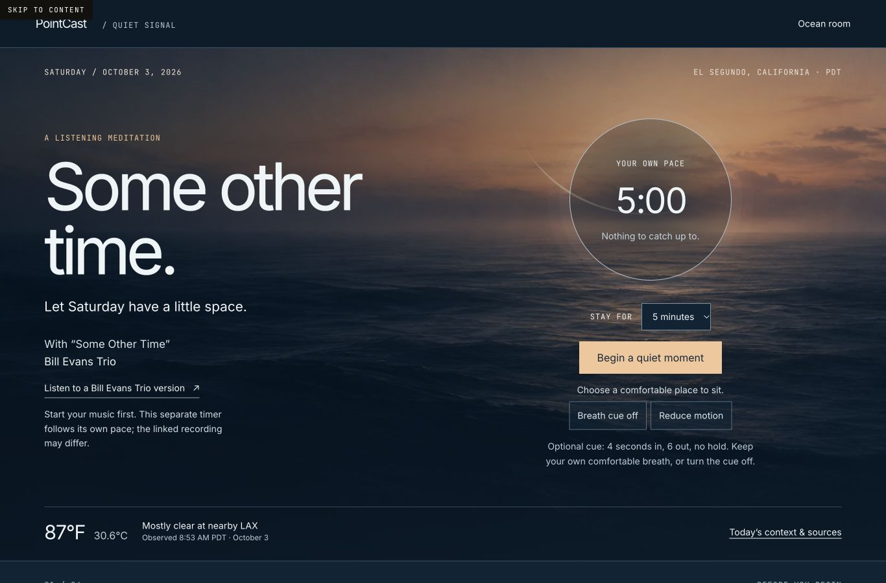
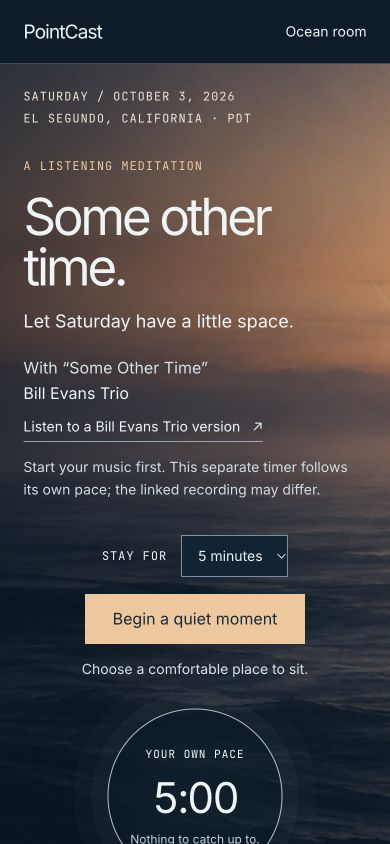

# Saturday listening meditation · October 3, 2026

Built from fresh `origin/main` `551bd6e62b4126a811cbc5eba7e4ea831c5bc5c0` in `~/pc-saturday-meditation`, branch `codex/saturday-meditation-20261003`. Draft PR: https://github.com/mhoydich/pointcast/pull/1320. Implementation reviewed and compiled at `6f440961cf469a3fd2c6c02f5ad6c9d6d3e83000`; the subsequent evidence commit changes documentation and screenshots only.

`/meditate/2026-10-03/` pairs original Pacific artwork and original meditation text with the user's “Some Other Time” by Bill Evans Trio. A separate, user-started 3-, 5-, or 8-minute session moves through Arrive, Listen, Widen and Carry. Pause/reset, optional comfortable 4-in/6-out breathing without holds, reduced motion, reflection choices and the complete readable meditation keep the experience usable at the visitor's pace. The isolated block layout avoids global wallet/auth/presence scripts. No audio, lyrics, album artwork, private screenshot or synchronized playback is hosted. An authorized Apple Music link opens a Bill Evans Trio version; the supplied screenshot's exact recording remains unidentified.

## Dated research

The edition uses America/Los_Angeles and displays October 3 PDT. Sources and uncertainty are also available at `/meditate/2026-10-03.json`.

- NOAA KLAX observation: October 3 at 8:53 AM PDT, mostly clear, 87.1°F / 30.6°C. Airport station is approximately 2.1 miles northeast of the El Segundo forecast point, not a neighborhood reading.
- NWS October 3, 4:11 AM PDT forecast: sunshine. Its retrieved 81°F high fell below the nearby observation, and fetched values changed; the forecast high is intentionally null. Coastal Extreme Heat Warning and its expiry are cited separately.
- Mattel's official 2026 calendar schedules El Segundo's Hot Wheels Legends Tour for October 3. Attendance and on-site conditions are unverified.
- A same-day Reuters Odesa report is behind an optional native disclosure. Yesterday's October 2 UN non-violence message is explicitly dated; indexed official 2026 text and a dated UN event record supplied verification because direct retrieval was unavailable.
- The artwork is an imagined Pacific scene, clearly distinguished from measured conditions. Generated raster was visually inspected before conversion to the 84 KB WebP.

## Validation

- `node --test tests/saturday-meditation.test.mjs`: 4/4 pass. Covers real elapsed time, frozen pause/resume/reset/completion, phase boundaries for every supported duration, continuous breath timing and dated provenance/audio boundaries.
- Independent review of implementation head `6f440961cf469a3fd2c6c02f5ad6c9d6d3e83000`: clean. Forecast uncertainty, stable motion control labeling, phase-only screen reader cues and mobile start ordering were reviewed after corrections.
- Initial whole-repository `npm run build:bare`: exit 0; 2,808 pages in 2,430.75 seconds, completed 10:19:35 AM PDT. This build began before final copy/accessibility/mobile corrections, so it does not certify the final route output. Static entrypoint bundling alone took about 23 minutes; the process was slow but completed.
- Fresh focused production build of unchanged final route and JSON source: passed in 136.24 seconds, using original Astro config/integrations, symlinked page entries with path preservation and cloned dependencies. Verified original fonts/styles, compiled client session module, final heading/music/cue/mobile CSS and exact JSON payload. Portable output is 18.84 MiB / 47 files. Actual page assets all resolve; unrelated site routes are outside this focused preview.
- Native Chrome QA exercised start, pause/resume, frozen paused clock, reset, duration selection, breath cue, reduced motion, reflection choices and readable meditation. Final production output also exercised start/breath/pause/reset. At 320×800, 390×844 and 1366×900 there is no horizontal overflow; Begin remains in the first mobile viewport (bottom 666 px and 644 px respectively). Saved final production screenshots below.

VoiceOver speech was not exercised. Visibility pause and BFCache handling were code-reviewed; automated focus emulation prevented a trustworthy native background-tab test. The pre-existing web manifest references four PWA icons absent from source public assets; these are outside this change. Only an installed wallet extension emitted a browser console error; no meditation runtime error was observed.

## Release state

No shared homepage, discovery, books, wallet/auth or deployment files changed. Draft PR remains unmerged and undeployed. Mike's explicit approval and the parent's serialized release lane are required. The pending worktree is retained without generated dependencies or whole-site output; the small portable preview remains outside the repo for review.

Signed: Codex · GPT-6 family · October 3, 2026
