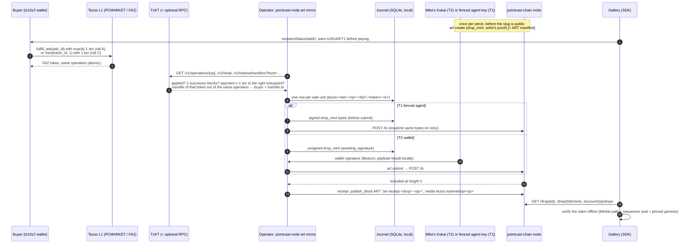

# Art minting: a 1 tez Tezos sale + a pointcast-chain certificate

> **Status: local rehearsal.** There is no public pointcast-chain node and no
> certificate has been issued or promised. The Tezos token is the only thing
> sold. Nothing in this package sends a Tezos operation, holds a Tezos key, or
> leaves the machine. Branch `concept/art-mint-api`; no consensus change.

Mike asked Codex (ChatGPT app) for a 50-piece "Midjourney originals + v2s"
gallery where a piece costs **1 tez** and is **minted on Tezos and on the
PointCast blockchain** (pointcast-chain, this repo). Codex owns the Tezos
purchase flow. This document is the pointcast-chain side: what is possible,
the recommended shape, the API, the SDK, the mirror CLI, failure handling, and
the exact steps that need Mike. Section 12 is a handoff addressed to Codex.

Everything below was checked against pointcast-chain `main` at `e4b2ea3` and
PointCast `origin/main` at `551bd6e`.

---

## 1. What is and isn't possible today

| fact | where |
|---|---|
| The 1 tez can only be paid on Tezos. pointcast-chain has no tez; ATTN is its only asset and `drop_mint` has no price field. A pointcast-chain edition is therefore a **mirror of a Tezos sale**, not the sale. | `chain-core/src/types.rs` (`TxKind::DropMint { drop_id, recipient }`, tag 4) |
| The first minter of a `drop_id` becomes its **creator for good**; afterwards only the creator can mint, up to `max_drop_supply` (10,000, chain-wide). A buyer cannot mint their own certificate of a gallery drop. A mint to a slug that doesn't exist silently creates it (a typo makes a permanent junk drop). | `state.rs:715-743`, `params.rs:101` |
| Drop ids are 1..64 bytes of `[a-z0-9_-]`. Tezos op hashes are mixed-case, so `pc-art-<ophash>` is not a valid slug. | `state.rs:295` (`check_slug`) |
| Editions **cannot move**: there is no edition-transfer kind. A certificate is a first-collector record; it does not follow a Tezos resale. | `types.rs` (`Transfer` moves ATTN only) |
| Recipients must be tz1, tz2 or a registered pca1 agent. tz3, tz4 and KT1 buyers get the Tezos token but **no certificate** (parked). | `state.rs:433` (`can_receive`) |
| A tz1/tz2 string is byte-identical on both chains: the key that holds the Tezos token controls the pointcast-chain address. | `crypto.rs:151` |
| A 1/1 cannot be enforced on pointcast-chain (one chain-wide cap). It is enforced on Tezos (rail C contract cap) or is admin policy (rail A: the El Segundo FA2 admin can mint more). | `params.rs:101` |
| Wallet signing: Kukai/Temple sign `Tezos Signed Message: pointcast-chain <chain> <kind> sender <addr> nonce <n> digest <hex>`. The wallet shows only kind, sender, nonce and digest, never the drop or recipient, so the page must show a locally rebuilt summary. | `wallet.rs:38-57`, `types.rs` (`wallet_message`) |
| **An agent with no mandate is unrestricted** (scope is checked only if a mandate exists). An agent house key must be fenced with `set_mandate`; revoke with `set_mandate kinds=0`, never `clear_mandate`. Mandates restrict kind and channel, never `drop_id`. Only humans can register agents. | `state.rs:526`, `state.rs:769`, `mandate.rs` |
| Mempool and rejected-tx memory are RAM only; after a restart `GET /tx/{h}` says `unknown`. Rejected txs don't consume their nonce. Resubmitting included bytes fails with "tx already included". A future-nonce tx waits 20 blocks. | `node.rs:16-17,106` |
| `--dev` keys are derivable by anyone (`blake2b("pointcast-dev/<name>")`): dev-chain claims and certificates prove nothing. | `keys.rs:9` |
| There was no `/drops` or `/drop/{id}` read route (this package adds them). There is no hosted node: "minted on PointCast chain" is false until Mike hosts one on the final v2 genesis with non-dev keys. A v2 re-genesis would wipe any certificates minted before it. | `api.rs` |

## 2. Build options (condensed)

| | Tezos rail | pointcast-chain side | consensus | Mike signs | fit |
|---|---|---|---|---|---|
| **A** | PCMARKET `KT1X9LU…` `list_ask` 1 tez per edition, El Segundo FA2 `KT1N1U6…` tokens (Codex's current plan) | mirror: certificate after an applied, final purchase | none | FA2 mints, `update_operators`, one `list_ask` per edition | 1/1s and tiny editions; no origination; Mike nets the 1 tez (fee/royalty receivers are all tz2FjJ today) |
| **B** | objkt ask, `editions=N` | same mirror | none | objkt mints + asks | discovery; fee unverified; buyers on objkt.com never see the certificate |
| **C** | mint-on-purchase FA2 (clone of `campus_cards_fa2.py`): buyer calls `mint(token_id, qty)` with qty × 1 tez | same mirror (from = null) | none | origination + `add_card` per piece | editions > 3; cap enforced on L1 (admin can still raise it via `set_card`) |
| **D** | none: open mint priced in ATTN (`drop_create`/`drop_buy`) | native | **batch-2 kinds** (tag ≥ 18, ext module 6; mandate mask is u16 so agents can't use it) | pricing policy | v2's "ATTN carries value"; does **not** meet the 1 tez requirement |
| ~~E~~ | x402/Stripe off-chain receipt | — | — | — | dropped: needs a hot Tezos key to deliver a token |

Who signs the certificate:

- **T2, Mike's wallet (default).** Mike's Kukai is the drop creator and signs
  each certificate (and its receipt) through Beacon. Nothing custodial;
  consistent with "Mike signs every on-chain transaction". About two to three
  prompts per sale; fine for ≤ 50 pieces. `art mirror --signer wallet` +
  `art submit`.
- **T1, fenced gallery agent (opt-in).** Mike's tz2 registers a pca1 agent and
  fences it with a mandate (drop_mint + publish_block on `ART`, no allowance,
  14–30 day expiry). Its key is `PC_ART_HOUSE_KEY`, held outside the node
  process and never as `PC_MCP_AGENT_SECRET` (anyone without an `Origin`
  header can drive the MCP agent). A leaked key can sell out every gallery
  drop with forged certificates, post fake receipts and squat slugs, but not
  move ATTN. Response: `set_mandate` with kinds = 0.
- ~~T3, buyer self-receipt~~: dropped (invalid slugs, front-running, provenance
  only off chain).

The signer is fixed **per drop** (the creator is permanent); it can only be
revisited at the v2 re-genesis.

## 3. Recommendation

1. **Rail A** for 1/1s (state honestly that the 1/1 is admin policy). **Rail C**
   only if editions > 3, with treasury = tz2FjJ (never the 1-of-2 project
   safe, which a hot key can drain alone). **Rail B** only for discovery.
2. **Certificate signer T2** by default; T1 only on Mike's explicit opt-in.
3. **Build now, local-only, non-consensus** (this package): read API, mirror
   CLI with a journal, SDK, demo. Test seeds only; TzKT fixtures in tests.
4. **Copy now:** "PointCast chain: rehearsal; no certificates issued or
   promised. The Tezos token is the only thing sold." When live: "free
   first-collector certificate on PointCast chain; non-transferable; does not
   follow a Tezos resale; tz1/tz2 wallets only." The certificate is never part
   of what the buyer pays for, so a late or failed certificate is never a
   refund claim. Keep ATTN-as-value language out of sale copy. The art is
   AI-generated: grant a display licence only, and Mike should confirm his
   Midjourney plan allows commercial sale (not legal advice).

## 4. The dual-chain flow



## 5. Node API (new routes)

New file `crates/node/src/api_art.rs`, merged with one line in `api.rs`.
Every response carries `chain_id`, `genesis_hash`, `height` and `dev_keys`
(true when the chain is sealed by the public dev sequencer or any other
well-known public dev key; claims from it prove nothing).

| route | returns |
|---|---|
| `GET /drops?prefix=&creator=&after=&limit=` (limit ≤ 200, default 50) | `{max_drop_supply, total_drops, drops:[{id, creator, minted, remaining}], next_after}`, sorted by id |
| `GET /drop/{id}` | `{id, exists, creator, creator_info:{kind:"human"\|"agent", owner?, name?, mandate?:{kinds, channels, expires_at, expired, paused, spend_*}, unfenced?}, minted, chain_cap, remaining, first_height, first_tx_hash, index:{indexed_to, complete}, index_consistent}`. 400 for an invalid id; `exists:false` (with a note, no "claimable" field) for an unknown one. |
| `GET /drop/{id}/mints?from_seq=&limit=` (≤ 500) | `{mints:[{seq, height, index, timestamp, tx_hash, sender, recipient}], next_from_seq, total_indexed, indexed_to, complete}`. Editions can't move, so this **is** the holder list. `seq` is pointcast-chain order, **not** a Tezos edition number. |
| `GET /account/{address}/drops?at=tip\|anchor&height=&drop=` | `{address, exists, kind, editions:[{drop_id, count, creator}], total_editions, editions_height, claim_kind, claim_height, claim, claim_error?}`. `claim` is a chain-proof `PortableClaim`: at the tip a `HeaderClaim` (sealed header), at `at=anchor` (or `height=`) a `BalanceClaim` at an anchor. An unknown address gets an absence proof. With an anchor claim, `editions` are the ones the claim proves at `editions_height` (not the tip's). `editions` and `creator` are the node's word; only the verified claim is proof, and **the claim does not cover who created a drop**. |
| `POST /drops/prepare-mint` `{sender, drop_id, recipient, nonce?, create?}` | `{ok, tx, next_nonce, would_create, advisory:{sender, nonce, mandate, drop_id, recipient, creator, supply}, digest, wallet:{signing_type, text, payload}\|null, error?}`. Refuses (`ok:false, error:would_create`) to prepare a mint that would create a drop unless `create:true`. Advisory checks follow `State::apply_tx` order and are pinned to it by a parity test. `wallet` is null for agent senders (they sign the raw digest). |
| `POST /tx/simulate` (a `SignedTx`) | `{ok, nonce:"current"\|"ahead"\|"stale", would_create, receipt\|error}` from the **real** `State::apply_tx` on a copy of the tip at height + 1 (queued mempool txs are not applied). Each call clones the whole state under the node lock: fine on localhost, but rate-limit or disable it on a public node. |

Reused unchanged: `/status`, `/params`, `/account/{a}`, `/agent/{a}/mandate`,
`/proof/account/{a}`, `/proof/claim/{a}`, `POST /tx/digest`, `POST /tx`,
`GET /tx/{h}`, `POST /body`, `GET /body/{h}`.

The mint index is in memory, advanced lazily (≤ 20,000 blocks per request,
under the node lock, so the first reads on a long chain briefly hold up block
production; warm it before opening a public node)
and reused only while the store still has the same block hash at the height it
was built to, so `store.rs`/`node.rs` are untouched and two chains behind one
genesis never share rows.

```sh
curl -s localhost:8545/drop/coffee-mug-0
curl -s 'localhost:8545/account/tz1KqTpEZ7Yob7QbPE4Hy4Wo8fHG8LhKxZSx/drops?drop=coffee-mug-0'
```

## 6. SDK quickstart (`sdk/pointcast-chain.js`)

One zero-dependency ES module (browser and Node 20+), vendorable into
PointCast's `public/js/`. It mirrors chain-core byte for byte: the vectors in
`sdk/test/vectors.json` are written by `crates/node/tests/sdk_vectors.rs` from
chain-core, the Rust test fails if they drift, and `node --test sdk/test`
checks the JS against them.

```js
import * as pcc from "/js/pointcast-chain.js";

// Pin the chain in your config. With node null you get {status:"no_node"}.
const chain = await pcc.connect(config.node, { expect: { chainId: config.chainId, genesisHash: config.genesisHash } });

// Before the Tezos purchase: can this buyer get a certificate?
pcc.recipientStatus(buyer); // "ok" | "needs_tz1_tz2" | "contract_no_certificate" | "agent" | "invalid"

// Gallery reads.
const drop = await chain.getDrop("coffee-mug-0");             // creator, minted, first_height…
const mints = await chain.getMints("coffee-mug-0");           // = holders
const h = await chain.getHoldings(buyer, { drop: "coffee-mug-0" });
h.verification.verifiedHolder; // see below; h.verification.holderReason says why not
pcc.certificateCopy("no_node"); // canonical, honest copy strings

// T2: Mike signs a certificate in Kukai (Beacon DAppClient or Taquito BeaconWallet).
const tx = await chain.buildDropMint({ sender: mikeTz2, dropId: "coffee-mug-0", recipient: buyer });
const prepared = await chain.digest(tx);          // node digest must equal the local rebuild
showSummary(tx, prepared.wallet.text);            // Kukai shows only kind/sender/nonce/digest
const signed = await chain.signWithBeacon(dAppClient, prepared);
await chain.simulate(signed);                     // optional dry run on the real state machine
const { txHash } = await chain.submit(signed);    // node's tx id must equal the local one
await chain.waitForTx(txHash);
```

Pure exports: `blake2b`, `sha256`, base58check, `addressKind`, `isAddress`,
`recipientStatus`, `tezosAddress`, `agentAddress`, `parsePublicKey`,
`parseSignature`, `encodeTx`, `signingHash`, `walletText`, `packString`,
`walletSignedDigest`, `txHash`, `bodyHash`, `paramsHash`, `encodeAccount`,
`DROP_ID_RE`, `checkDropId`, `artDropId`, `verifyClaim`, `verifyOwnership`,
`holdingsFromClaim`, `certificateCopy`, `DEV_PUBLIC_KEYS` (every well-known
public dev key; a chain sealed by any of them reports `devKeys: true`, same
list as the node's `dev_keys`), `devWallet` (public dev keys; refused by
`signWithBeacon` on any non-dev chain).

**`verifiedHolder`** (the only thing a gallery may badge) is true only when
all of these hold: a `drop` / `dropId` was named (anyone can create a drop
and mint an edition to any address, so "holds some edition" means nothing);
the genesis was **pinned by the caller** (`connect(..., {expect: {genesisHash}})`
or `verifyOwnership(..., {genesisHash})`; params fetched from the same node
prove nothing); the claim verified, including the sequencer seal; it is not a
dev chain; it is about the right address; and it shows at least `min`
editions. The claim proves editions **under the drop id**; it does not prove
who created the drop (no drop proof route yet), so also pin the creator in the
gallery config and only show drops the manifest lists.

**Ownership checks** (`verifyOwnership`) run in JS: params must hash to the
pinned genesis; the claim's account leaf is walked up its Merkle path to the
state root (v2 or v3 formula); that root must be in a header sealed (or an
anchor signed) by the params' sequencer key, bound to the genesis. The seal is
checked with WebCrypto Ed25519; where a runtime lacks it, `ok` can be true but
`verified` stays false and `reason` says why. The in-repo wasm verifier has no
claim op, and adding one changes `crates/chain-wasm` (whose pinned artifacts
the presence-tickets lane owns), so this is deferred.

## 7. The mirror CLI (`pointcast-node art …`)

New files `crates/node/src/cli_art.rs` and `cli_art/{sale,journal,chain}.rs`;
one dispatch line and one usage line in `main.rs`. `pointcast-node art help`
prints the full reference.

```sh
# Once per piece, before the slug is public (T1 shown; T2: --signer wallet --sender tz2…)
pointcast-node art create --drop coffee-mug-0 --node http://127.0.0.1:8545           # dry run
pointcast-node art create --drop coffee-mug-0 --node http://127.0.0.1:8545 --yes

# After a sale (rail A: buyer paid the marketplace, --seller = the house wallet that listed;
# rail C: --pay-to defaults to the FA2, entrypoint mint, --seller defaults to mint)
pointcast-node art mirror --tezos-op ooovVC2f… --contract KT1JQ3Aj… --token-id 0 \
    --pay-to KT1DoUow… --seller tz2FjJ… --drop coffee-mug-0 --db data/art-mirror.sqlite   # plan only
pointcast-node art mirror … --yes                                                    # mint + receipt
```

What `mirror` checks before anything is signed: every operation in the group
`applied`; ≥ 2 successor blocks (`--min-successors`); with `--rpc`, the block
hash at that level agrees between TzKT and the RPC; a **top-level** payment to
`--pay-to` through `--entrypoint` of ≥ `--price-mutez` (default 1,000,000)
per unit; a transfer of exactly `--contract #--token-id` out of the same
operation (same counter, so the marketplace's internal FA2 call counts)
**from a house seller** (`--seller`; `mint` = from null), so a resale or a
third-party listing of the same token, or a wash sale to a second wallet,
never mints another "first-collector" certificate; TzKT's `/v1/head` `chain`
equals `--network` (the network is part of every sale key); the indexer's
answer is well formed (no duplicate operation or transfer ids, no overflowing
sums, at most 10,000 units per operation, refused before anything is
expanded); the drop exists and the signer created it; one drop mirrors one
(contract, token id), both ways. The certificate goes to the transfer's `to`
(not the payer). Before minting, the recipient's on-chain editions of the drop
must not exceed what this journal accounts for (see §8).

The seller check relies on the marketplace transferring **from the seller**
(operator transfers, as PCMARKET v3 does). On an escrow marketplace the token
comes from the marketplace contract for every listing, so `--seller` could not
tell the house's sale from a resale: do not use one for gallery sales.

| flag | |
|---|---|
| `--yes` | sign and submit; without it nothing is signed or journaled |
| `--seller a,b` | the house wallet(s) the token may come from (required when `--pay-to` is a marketplace; `mint` = a mint, the default when `--pay-to` is the FA2). Sellers are also excluded as recipients |
| `--allow-unjournaled-holdings` | mint even if the recipient already holds editions of the drop this journal doesn't know (only for an `art create --to` proof you made yourself) |
| `--signer agent\|human\|wallet` | T1 fenced agent (default, key from `PC_ART_HOUSE_KEY`), bare key (dev/tests), or T2 wallet (`--sender`) |
| `--dev` | use the public dev key, only on a chain sealed by the public dev sequencer |
| `--to <tz1\|tz2>` | redirect one **parked** (tz3/tz4/KT1) unit to a tz1/tz2 the buyer proved off chain is theirs; refused for a tz1/tz2 buyer |
| `--exclude a,b` | more house wallets (the signer and the agent's owner are always excluded) |
| `--tzkt URL` / `--tzkt-fixture DIR` / `--rpc URL` | live TzKT (read-only), recorded answers, optional second source |
| `--max-units N` | most **new** units handled per run (already-recorded ones don't count); exit 75 while more remain |
| `--network` | lowercase TzKT network name; must equal what the indexer serves |
| `--no-receipt`, `--retry-failed`, `--wait-secs`, `--allow-unfenced` | |

Exit codes: `0` done (or nothing to do, or awaiting a wallet signature), `2`
not a qualifying sale, `3` only parked/excluded recipients, `75` try later
(not final, indexer lag, tx in flight, queued behind a pending signature),
`1` error. The house key: `PC_ART_HOUSE_KEY` is refused on a public dev chain
(use `--dev` there), `--dev` is refused while `PC_ART_HOUSE_KEY` is set, and
any well-known public dev key is refused on a real chain. A malformed key is
reported without echoing any of it.

Other commands: `art setup-dev` (dev chains: register + fence the house agent
from the dev treasury), `art house --owner tz2… [--node URL]` (prints the agent
address and the two txs Mike signs, with digests and wallet text),
`art submit --signed FILE [--sale-key K --db PATH]` (wallet signatures),
`art status` (journal rows + event log), `art record-fixture` (save the TzKT
answers for an op into a `--tzkt-fixture` directory).

Fixtures in `crates/node/tests/fixtures/art-tzkt/`: a real PCMARKET-v3
`fulfill_ask` (1 tez, Coffee Mug #0, `ooovVC2f…`) and a real Kennel Club 1 tez
`mint` (`ooNP2rzP…`), recorded read-only from TzKT, with the buyers swapped for
the sandbox bootstrap accounts.

## 8. Failure handling

**Retries never double-mint, within one journal.** `drop_mint` has no memo, so
the journal is the guard. Keep **one journal per house signer, for good**, and
back it up:

- the signed bytes, tx hash and nonce are written **before** submit;
- a retry resubmits the same bytes; "tx already included" is success;
- a row is terminal only when the node rejected it, or the signer's nonce has
  moved past it and the node doesn't know the hash (`lost`);
- nothing new is signed while any row of that signer is in flight;
- one mirror per journal: the SQLite connection holds an exclusive lock for its
  whole life (a second opener fails at once; no stale lock files);
- one token, one drop, both ways; the mirror never creates drops;
- backstop for a lost, replaced or second journal: before minting, the
  recipient's on-chain editions of the drop must not exceed the certificates
  this journal accounts for, or the mirror refuses (`--allow-unjournaled-holdings`
  overrides); the same operation unit under another key (another `--network`
  spelling) is refused too. A brand-new buyer whose first certificate is in
  flight from a second journal at that very moment is the one race this cannot
  see, so never run two mirrors for one house signer.

Journal states: `parked_recipient`, `excluded_house`, `awaiting_signature`,
`signed`, `included`, `receipt_awaiting_signature`, `receipt_signed`,
`receipted`, `rejected`, `lost`. Sale keys are per unit
(`tezos:<net>:<op>:<fa2>:<token>:<k>`), so two purchases batched in one
operation are two certificates; a gift batched next to a purchase is none.

**Reorgs.** Tenderbake is final after two successor blocks; the mirror waits
for them and can cross-check the block hash with an RPC (`--rpc`). Nothing on
pointcast-chain can be burned: if an operation the journal already mirrored
stops being confirmed, the mirror warns ("possible reorg, do not re-mint"); the
certificate stays (editions can't be burned) unless a later re-genesis drops it.

**Refunds.** Payment and token delivery are one atomic Tezos operation on every
rail (a failed operation moves no tez; the amount is enforced by the rail
contracts as read, and the mirror independently requires ≥ the price per
unit). The certificate is free and
best-effort and is never part of what was bought, so it is never a refund
reason. A goodwill refund is a manual Kukai transfer outside this system.

**Mismatched addresses.** tz1/tz2 buyers get the certificate at the same
address. tz3/tz4/KT1 (including TzSafe through Beacon) are parked in the
journal; a parked certificate is never minted to a house address (it would be
stranded). `--to` can redirect one parked unit after the buyer proves a tz1/tz2
off chain (a signed message; not verified by this tool). Test buys from house
wallets (the signer, the agent's owner, `--exclude`, every `--seller`) are
excluded.

**Indexer lag / node restarts / mandate expiry.** Lag → exit 75, retry. A node
restart forgets the mempool → the next run resubmits the journaled bytes.
An expired or missing mandate fails the fence check before anything is signed.

## 9. Data contracts

- **Receipt** (`publish_block` on `ART`): title `art-receipt <drop_id> <op_hash>`,
  `media_uri` `tezos:<network>/op/<op_hash>`, body (stored with `POST /body`,
  committed by hash):

  ```json
  {"schema":"pointcast.art-receipt/v1","sale_key":"tezos:mainnet:<op>:<fa2>:<token>:<k>",
   "tezos":{"network":"mainnet","op_hash":"…","level":0,"block":"…","contract":"KT1…","token_id":"0",
            "unit":0,"payer":"tz…","paid_mutez":1000000,"buyer":"tz…"},
   "pointcast_chain":{"drop_id":"…","recipient":"tz…","mint_tx_hash":"…",
            "certificate":"first-collector, free, non-transferable; does not follow a Tezos resale"}}
  ```

- **Manifest** (`art create --manifest FILE`): any ≤ 64 KiB body, posted on
  `ART` as `art-manifest <drop_id>`; suggested schema
  `pointcast.art-manifest/v1` binding drop id ↔ FA2/token id, the SHA-256 of
  the original and the v2, and the artifact URIs. Readers trust a drop or post
  only if its creator/sender is the pinned signer **and** it appears in the
  pinned manifest, never channel `ART` or a slug alone.

## 10. What is local-only today

Everything. The node runs on localhost; the demo (`scripts/art-demo.sh`,
`examples/art-gallery-demo/`) uses `--dev` keys; TzKT is read only in code
paths and through recorded fixtures in tests. No certificate exists anywhere
that a third party could check.

## 11. Steps that need Mike

1. Tell Codex pointcast-chain exists; pass on this file and the
   `networks.pointcast` block in §12.
2. Choose the rail (A recommended for 1/1s), the FA2 and token ids, the edition
   count, metadata hosting (`PINATA_JWT` or HTTPS + SHA-256), and royalties.
3. Sign the Tezos side in Kukai: FA2 mints, `update_operators`, one `list_ask`
   per edition (rail A), or the origination and `add_card` calls (rail C, with
   treasury = tz2FjJ). Approve Codex's RPC **dry run** of `fulfill_ask` from a
   non-seller address (it injects nothing).
4. Choose the certificate signer: **T2** (his Kukai signs each certificate via
   `art mirror --signer wallet` + `art submit` or a Beacon desk on the SDK), or
   **T1**: sign `register_agent` + `set_mandate` back to back
   (`art house --owner tz2… --node URL` prints both), and hold
   `PC_ART_HOUSE_KEY` on the mirror host, outside the node process.
5. Host a public pointcast-chain node on the final v2 genesis with non-dev keys
   **before** any certificate is called issued. Until then the copy stays
   "rehearsal".
6. Approve the copy rules in §3 (and check the Midjourney plan for commercial
   sale).

## 12. HANDOFF to Codex

**Call these** (all read-only for the gallery):

- `pcc.connect(config.node, {expect:{chainId, genesisHash}})`. With
  `config.node = null` (today) every read returns `{status:"no_node"}`;
  render `pcc.certificateCopy("no_node")`.
- `pcc.recipientStatus(buyer)` before the purchase: warn tz3/tz4/KT1 that the
  Tezos purchase works but no certificate can be issued.
- `chain.getDrop(dropId)`, `chain.getMints(dropId)`,
  `chain.getHoldings(addr, {drop})` and badge only on
  `verification.verifiedHolder`, which needs `drop` and a genesis pinned at
  `connect` (`expect.genesisHash`); without either it stays false
  (`holderReason` says why). Check `getDrop(id).creator` against the pinned
  signer too: the claim does not prove a drop's creator.
- The signing path (`buildDropMint` → `digest` → `signWithBeacon` → `submit`
  → `waitForTx`) belongs on Mike's desk, not the public gallery.

**Do not assume:**

- that the PointCast chain takes payment (it has no tez; the 1 tez is Tezos only);
- that a certificate transfers or tracks the current owner (read the owner from Tezos);
- that a `seq` / mint number is the Tezos edition number;
- that a buyer can mint for themselves, or that any address type works (tz1/tz2 only);
- that a drop slug or channel `ART` alone proves provenance (pin signer + manifest);
- that anything on a `--dev` chain proves anything (`dev_keys: true`);
- that the certificate is live: no public node exists yet.

Replace `networks.pointcast` in `src/data/art-v2-commerce.json` with:

```json
{"status":"local_rehearsal","label":"PointCast chain","chainId":"pointcast-dev","genesisHash":null,"node":null,
 "certificate":{"kind":"first_collector","issued":false,"promised":false,"transferable":false,"followsResale":false,
   "price":"free, not part of the 1 tez purchase","eligibleRecipients":["tz1","tz2"],"signer":null,
   "trigger":"applied gallery sale, 2 successor Tezos blocks"},
 "snapshot":null,"minted":false,"listed":false,
 "note":"Local rehearsal only. No public node; no certificates issued or promised. The Tezos token is the only thing sold."}
```

Also on the Tezos side (from the critic, not this package): one ask per
edition (Codex stores one `askId` per artwork); `fulfill_ask` sends the token to
`sp.sender` (no proxy); `M_NO_SELF_FULFILL` blocks test buys from tz2FjJ.

## 13. Design notes and deviations from the brief

- The journal is keyed **per sale unit** (op hash indexed), not by op hash
  alone, so batched purchases never collapse into one certificate.
- The house key from `PC_ART_HOUSE_KEY` is the T1 path; the critic's default
  T2 (Mike's wallet) is also implemented (`--signer wallet`, `art submit`).
- `--db` is the mirror journal (SQLite with an exclusive lock), not the node db.
- The mirror adds a receipt `publish_block` per certificate (on by default) so
  the Tezos op is on chain next to the mint; `drop_mint` has no memo.
- `POST /drops/prepare-mint` (not `/drop/mint/prepare`) keeps a static path
  from shadowing a drop literally named `mint`.
- Ownership claims are verified in JS (Merkle + WebCrypto Ed25519), not by the
  wasm verifier (no claim op; changing chain-wasm breaks its pinned rebuild).
- Adversarial review (same branch): the mirror requires the token to come
  from a house seller (`--seller`; resales are not sales), checks `--network`
  against TzKT, refuses malformed indexer answers, refuses to mint when the
  chain shows certificates the journal doesn't know, binds one drop to one
  token both ways, and lets `--max-units` progress across runs; the house key
  rules were tightened; `verifiedHolder` now needs a drop and a pinned genesis;
  anchor holdings list the proven editions; the demo builds its DOM without
  `innerHTML` and only auto-connects `?api=` on loopback.
- Deferred: `art audit` / `art export` snapshot (`pointcast.art-twin/v1`),
  `GET /proof/drop/{id}`, MCP tools, in-browser wasm claim checks, a Beacon
  desk page, the hosted node.

## 14. Batch-2 consensus proposals (not in this package)

A memo / external-ref field on `drop_mint` (mint + receipt in one tx); a
per-drop cap, metadata hash and creation guard (`drop_create`, fixes squatting
and typo-drops); a creator revoke with a stated reason; a drop-prefix allowlist
in mandates; widening the mandate kind mask past 16 bits (and a checked
`kind_bit`); `drop_transfer`; wallet text v2 that shows drop and recipient;
option D's `drop_buy` priced in ATTN.

## 15. Tests

```sh
cargo test -p node --offline --test art_api --test art_mirror --test sdk_vectors
node --test sdk/test                 # or: cd sdk && npm test
scripts/art-demo.sh                  # live smoke on 127.0.0.1:8596 (dev keys, fixtures)
```

`art_api` (8): routes, paging, claims that verify and fail when tampered,
agent creators and fences, prepare-mint, the advisory/apply_tx parity matrix,
simulate, index isolation, anchor holdings at the claim's height.
`art_mirror` (17): both real fixtures, every not-a-sale case, batched
purchases and gifts, parked/redirected/excluded recipients, not-final,
crash-before-submit / included-unheard / nonce-taken retries, the journal
lock, fences, squatted drops, the wallet signer; and the review cases:
resales and third-party listings, the indexer's network, hostile indexer JSON,
a lost journal, one drop per token, `--max-units` progress, the house key
rules. `sdk_vectors` (1) keeps `sdk/test/vectors.json` equal to chain-core.
The SDK suite (24) checks every encoding, hash, wallet payload and tx id
against those vectors, verifies Rust-built claims (and 16 tamperings), runs
the client against honest and lying fake nodes, re-seals a claim with a
non-dev key to pin what `verifiedHolder` may badge, and checks the demo page
has no HTML-string sinks.
